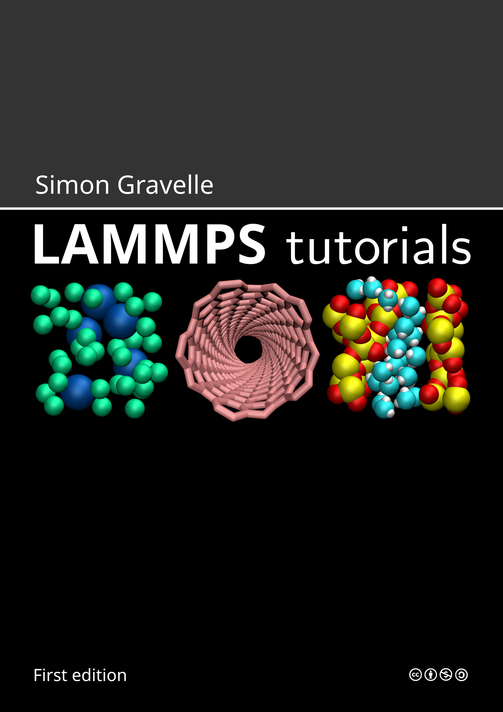

# LAMMPS tutorials: the living ebook

This repository contains Python scripts for converting the sphinx documentation
of [LAMMPS tutorials](https://lammpstutorials.github.io/) into LaTeX.

## Download the pdf

The pdf is available in [light](lammps-tutorials-ebook-lm.pdf)
and [dark](lammps-tutorials-ebook-dm.pdf) modes, and can
be downloaded from [the ebook/](ebook/) folder.

<p float="left">
  <a href="https://lammpstutorials.github.io">
  </a>
</p>

## Re-compile the pdf

Clone the repository with its submodule using

```bash
git clone https://github.com/lammpstutorials/lammpstutorials-ebook.git --recurse-submodules
```

Use the *compile-ebook.sh* script to compile the pdf.

## Acknowledgments ##

This project has received funding from the European
Union's Horizon 2020 research and innovation programme
under the Marie Skłodowska-Curie grant agreement No 101065060.


